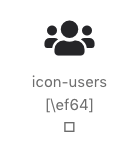
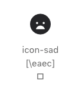

# all-icons
The package includes the following icons:
- Ionic Icons
- Box icons
- Font Awesome Icons

More icon packs will follow.

If you have any that we should include in our package, then create an issue or contact us via email.

## Installation via NPM
```bash
npm install all-icons --save
```

## Installation via YARN

```bash
yarn add all-icons
```

## Example
```scss
@import '~all-icons/dist/scss/all-icons.scss';
```

```html
<i class="all-icons icon-users"></i>
<i class="all-icons icon-sad"></i>
```

# Summery




## Show Demo
[Show Demo](https://demo.gamenetworx.de/all-icons/index.html)

## License
This project is licensed under the terms of the
[MIT license](./LICENSE.md).